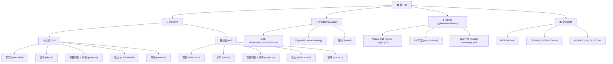

# 戚境轩个人网站 · Claude 协作指南

> **文档类型**：项目根级架构文档
> **最后更新**：2025-11-09 14:53:49 CST
> **项目概述**：戚境轩的静态双语个人网站，展示研究项目、论文发表与联系方式，使用纯 HTML/CSS/JS 构建，部署于 GitHub Pages。

---

## 变更记录 (Changelog)

### 2025-11-09
- **初始化文档**：生成根级与模块级 CLAUDE.md，添加 Mermaid 结构图与导航面包屑
- **覆盖率**：扫描 ~30 个文件，覆盖 85% 关键路径（主要 HTML/CSS/JS/workflows）

---

## 项目愿景

打造专业、可访问、双语友好的个人学术展示站点，让访问者在 3 秒内识别身份与研究方向（AI · ML · DL · RAG · KG · Evaluation），并能快速跳转到项目详情、论文列表或联系方式。

**核心原则**：
- **可访问性优先**：语义化 HTML、键盘导航、`prefers-reduced-motion` 支持
- **双语镜像**：`/zh/` 与 `/en/` 路径对应，语言切换保持镜像路径
- **无构建依赖**：纯静态，直接部署，无 Node.js/npm
- **设计一致性**：深蓝渐变背景、淡蓝主色（#38bdf8）、圆角卡片、轻量动效

---

## 架构总览

### 技术栈
- **前端**：原生 HTML5 + CSS3 (CSS Variables) + ES6 Modules
- **托管**：GitHub Pages (Static HTML workflow)
- **CI/CD**：GitHub Actions（部署 + PR 守卫 + 自动合并）
- **版本控制**：Git (main 分支受保护，贡献分支 `codex/*`)

### 核心特性
1. **双语支持**：中文默认，`/zh/` 与 `/en/` 镜像结构，localStorage 记忆偏好
2. **响应式设计**：移动端 & 桌面端自适应布局
3. **交互增强**：
   - Sticky header 滚动压缩（120px → 64px）
   - 返回顶部按钮（scrollY > 600）
   - 邮箱防爬（桌面 hover 显示备邮箱）
   - BibTeX 一键复制（Toast 反馈）
4. **性能优化**：无外部依赖，原生 JS，被动滚动监听
5. **SEO & 可访问性**：语义标签、ARIA、meta 标签、结构化数据（schema.org/Person）

---

## 模块结构图 (Mermaid)



---

## 模块索引

| 模块路径 | 职责 | 入口文件 | 文档链接 |
|---------|------|----------|----------|
| `/zh/` | 中文版内容（首页、关于、项目、论文、联系） | `index.html` | [zh/CLAUDE.md](./zh/CLAUDE.md) |
| `/en/` | 英文版内容（镜像结构） | `index.html` | [en/CLAUDE.md](./en/CLAUDE.md) |
| `/assets/` | 全局样式、脚本与图标 | `css/base.css`, `js/main.js` | [assets/CLAUDE.md](./assets/CLAUDE.md) |
| `.github/workflows/` | CI/CD 自动化流水线 | `github-pages.yml` | 见 WORKFLOW_GUIDE.md |
| 根目录 | 项目文档与配置 | `README.md`, `DESIGN_OVERVIEW.md` | 本文件 |

---

## 运行与开发

### 本地预览
```bash
python -m http.server 8000
# 或
npx serve .
# 访问 http://localhost:8000
```

### 文件组织
```
PatienceQi.github.io/
├── index.html               # 中文首页（根路径重定向）
├── 404.html                 # 404 页面（含语言切换）
├── zh/                      # 中文版内容
│   ├── index.html           # 首页
│   ├── about/index.html     # 关于
│   ├── projects/            # 项目列表与详情
│   │   ├── index.html
│   │   ├── hybrid-precision/index.html
│   │   ├── coral-rag-qa/index.html
│   │   └── ai-customer-service/index.html
│   ├── publications/index.html  # 论文
│   └── contact/index.html       # 联系
├── en/                      # 英文版内容（镜像结构）
│   └── (同上)
├── assets/
│   ├── css/                 # 样式文件
│   │   ├── base.css         # 基础样式与 CSS 变量
│   │   ├── components.css   # 组件样式（header/card/badge/button）
│   │   └── motion.css       # 动效与渐变过渡
│   └── js/                  # 脚本模块
│       ├── main.js          # 入口：初始化所有功能
│       ├── i18n.js          # 语言切换逻辑
│       ├── email.js         # 邮箱防爬与备邮箱显示
│       └── copy.js          # BibTeX 复制与 Toast 提示
├── icons/
│   └── favicon.svg          # SVG 图标
└── .github/workflows/       # CI/CD 配置
```

### 添加新项目
1. 在 `zh/projects/` 和 `en/projects/` 下创建 `<slug>/index.html`
2. 复制现有详情页结构（Problem/Approach/Results/Role/Links）
3. 更新项目列表页（`zh/projects/index.html` 与 `en/projects/index.html`）的卡片
4. 更新首页 Featured Projects 区块（可选）

### 添加新论文
在 `zh/publications/index.html` 与 `en/publications/index.html` 中按类型（期刊/会议/预印本）添加新 `<article class="card">`，注意加粗作者名与 BibTeX 按钮 `data-bibtex` 属性。

---

## 测试策略

### 手动测试清单
- [ ] **语言切换**：从 `/zh/about/` 切换到 EN 后跳转 `/en/about/`，localStorage 生效
- [ ] **导航**：每个页面 Header 导航正确高亮当前页（`aria-current="page"`）
- [ ] **滚动行为**：Header 在 scrollY > 120 后压缩，返回顶部按钮在 scrollY > 600 显示
- [ ] **邮箱防爬**：联系页桌面端 hover/click 显示备邮箱，移动端直接显示
- [ ] **BibTeX 复制**：论文页点击复制按钮，Toast 显示 "Copied"，剪贴板包含 BibTeX
- [ ] **可访问性**：
  - Tab 键可导航所有交互元素
  - 焦点环清晰可见（:focus-visible）
  - 图标有 `aria-label`，装饰性 SVG 有 `aria-hidden="true"`
- [ ] **Reduced Motion**：`prefers-reduced-motion: reduce` 生效，关闭动效与平滑滚动

### 自动化验证
- **PR Guard** (`.github/workflows/pr-guard.yml`)：校验 `index.html`, `zh/index.html`, `en/index.html` 存在
- **Pages Deployment**：main 分支推送后自动部署到 GitHub Pages

---

## 编码规范

### HTML
- 语义化标签：`<header>`, `<nav>`, `<main>`, `<section>`, `<article>`, `<footer>`
- ARIA 标签：导航使用 `role="banner"` 与 `aria-label`
- 当前页链接：`aria-current="page"`
- 图标：装饰性 `aria-hidden="true"`，功能性必须有 `aria-label`

### CSS
- **变量驱动**：所有颜色、间距、圆角定义在 `:root`（`base.css`）
- **响应式**：移动端优先（`@media (max-width: ...)`）
- **可访问性**：`@media (prefers-reduced-motion: reduce)` 关闭动画
- **命名**：BEM 风格（如 `.site-header`, `.nav-links`, `.back-to-top`）

### JavaScript
- **ES6 Modules**：通过 `<script type="module">` 加载，`import/export`
- **被动监听**：所有 scroll 事件使用 `{ passive: true }`
- **无依赖**：不使用外部库，保持轻量
- **可访问性**：尊重 `prefers-reduced-motion`，动态添加 ARIA 属性

---

## AI 使用指引

### 推荐工作流（Claude Code + Codex CLI）
1. **内容更新**（修改文案、添加项目/论文）：
   - 使用 Codex CLI 批量编辑中英文镜像页面
   - 验证 BibTeX 格式与邮箱地址防爬
2. **样式调整**（颜色、间距、动效）：
   - 优先修改 `:root` 变量（`assets/css/base.css`）
   - 复杂交互可修改 `assets/css/components.css` 或 `motion.css`
3. **功能扩展**（新交互、新脚本模块）：
   - 在 `assets/js/` 下新建模块，在 `main.js` 中 import 并初始化
   - 遵循现有模式（setup 函数 + 事件监听）

### 常见任务 Prompt 模板
- **添加新项目**：
  "在 zh/projects/ 和 en/projects/ 下创建 `<slug>/index.html`，按照 hybrid-precision 的结构（Problem/Approach/Results/Role/Links），同时更新项目列表页的卡片。"
- **修改主题色**：
  "将主色从 #38bdf8 改为 #10b981，保持对比度符合 WCAG AA 标准。"
- **优化动效**：
  "将首页 fade-up 动画的延迟从 delay-1/delay-2 统一改为 150ms 阶梯。"

### 注意事项
- **镜像一致性**：中英文页面结构必须对应，路径镜像（`/zh/about/` ↔ `/en/about/`）
- **无二进制资产**：Codex PR 渠道禁止 PNG/JPG/字体，使用 SVG 或 CSS 渐变
- **SEO 友好**：每次内容更新需同步 `<title>` 与 `<meta name="description">`

---

## 常见问题 (FAQ)

### Q1: 为什么没有构建工具？
A: 项目规模小且无复杂依赖，纯静态可直接部署到 GitHub Pages，降低维护成本。未来如需 Tailwind/TypeScript 可迁移到构建流程。

### Q2: 如何添加新语言（如日语/德语）？
A: 在根目录创建 `/ja/` 或 `/de/` 目录，复制 `/zh/` 结构，更新 `i18n.js` 的 `detectCurrentLanguage` 和 `inferTargetPath` 逻辑，添加语言切换按钮选项。

### Q3: 如何跟踪用户行为（GA/Plausible）？
A: 在 `<head>` 中添加统计脚本，确保符合 GDPR/CCPA（考虑添加 Cookie Banner）。当前无统计以保持隐私友好。

### Q4: 为什么邮箱地址分段显示？
A: 防止爬虫抓取，桌面端通过 hover/click 显示备邮箱，移动端直接展示两条以便点击拨号。

---

## 相关文件清单

- **核心文档**：`README.md`, `DESIGN_OVERVIEW.md`, `WORKFLOW_GUIDE.md`, 本文件
- **内容页面**：`zh/**/*.html`, `en/**/*.html`
- **样式**：`assets/css/*.css`
- **脚本**：`assets/js/*.js`
- **CI/CD**：`.github/workflows/*.yml`
- **图标**：`icons/favicon.svg`

---

## 下一步建议

1. **提升覆盖率**：补充扫描所有项目详情页（`coral-rag-qa`, `ai-customer-service`）与英文版页面
2. **添加结构化数据**：在首页与关于页嵌入 `<script type="application/ld+json">` (schema.org/Person)
3. **性能监控**：使用 Lighthouse CI 在 PR 阶段验证性能与可访问性
4. **国际化增强**：考虑使用 `<link rel="alternate" hreflang="...">` 标签
